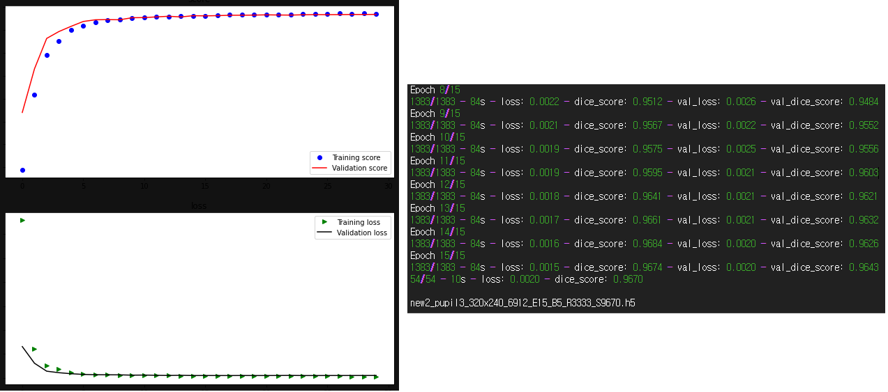
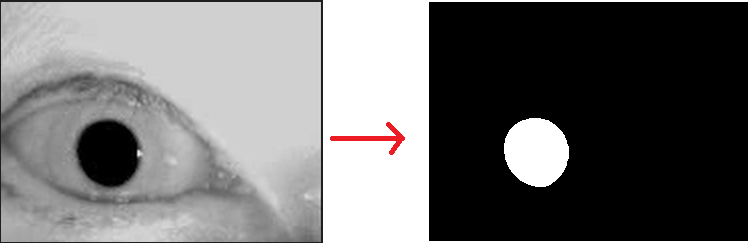
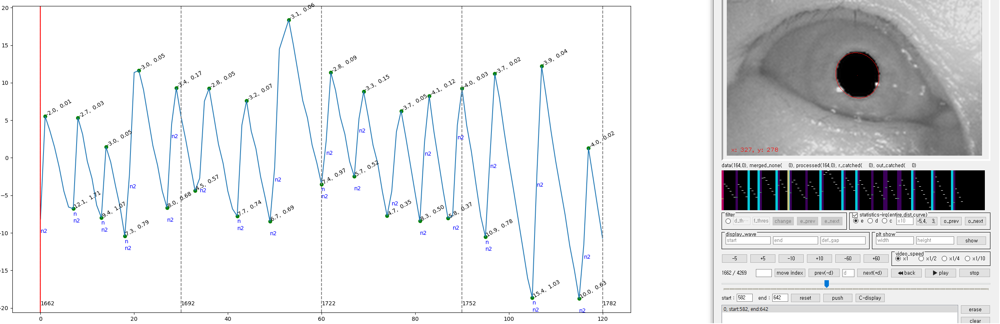

# Nystagmus auto detetion

first, extract eye center points from specified hospital eye video with U-Net.

second, some processing to calibrate center time series data.

third, find classification to detect nystagmus on patched(or splitted) time series data.

***
* Build custom U-net.

***
* Train results

***
* Segmentation to get center points

***
* Make video1

***
* Analysis time-series-center-points with tool to get nystagmus area

***
* Build another model to detect nystagmus by deeplearning model
* Make an algorithm to detect nystagmus by experts system
